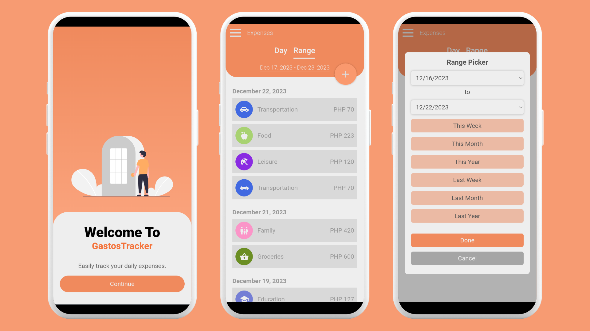

# GastosTracker
Easily track your expenses using GastosTracker, a hybrid mobile application for android devices.

## Table of Contents

- [Images](#images)
- [Download](#download)
- [Features](#features)
- [Technologies](#technologies)

## Images

## Download

Here are the following download links for GastosTracker.

- [Google Drive](https://drive.google.com/drive/folders/1WeVpNUpmO7RB34O7yfYJYc5E8ojxjLwU?usp=sharing)
- [MediaFire](https://www.mediafire.com/file/qoby8o8kw5mpfll/GastosTracker.apk/file)
- [Dropbox](https://www.dropbox.com/scl/fi/d2x4etk7hfyaaxjy0wsvp/GastosTracker.apk?rlkey=k1aanpykpvrwhlfxwpq0pqn52&dl=0)

## Features

### 1. Expense Entry

Record your expenses easily, capture these following details:

-   Amount
-   Date
-   Time
-   Category
-   Remarks

### 2. Expense History

Review your spending patterns by specified date or date range.

### 3. Expense Edit

Modify existing expense entries from your history with just a few clicks.

### 4. Expense Details

Allows you to view the information of a specific expense record.

### 5. Delete Expense Record

Allows of removal unnecessary entries.

### 6. Expense Summary

Get a quick overview of your expenses. This section reveals the total amount and percentage distribution of each expense category based on a specified date or date range.

## Technologies

I used the following technologies to develop GastosTracker.

- HTML
- CSS
- JavaScript
- [Figma](https://www.figma.com/)
- [SQLite](https://www.sqlite.org/index.html)
- [Visual Studio Code](https://code.visualstudio.com/)
- [DroidScript](https://droidscript.org/#)
